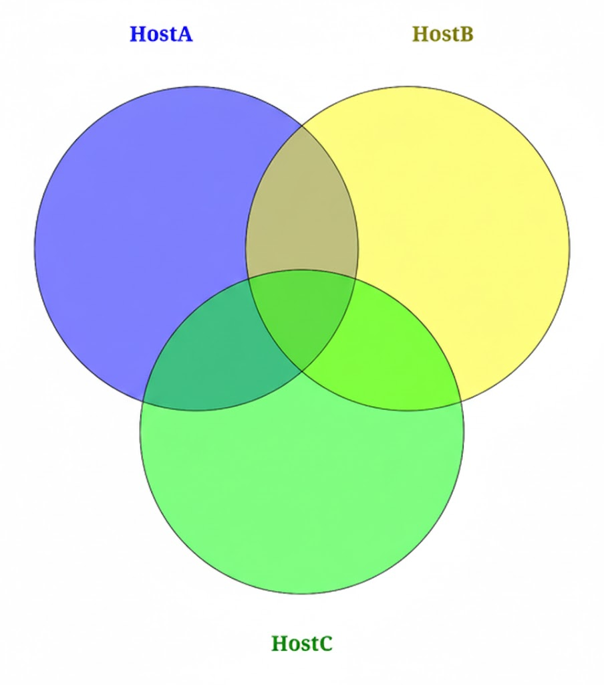

# RFLXN's NixOS Configurations

Personal NixOS flake configuration for multiple hosts with a modular architecture.

## Concept

### Why Module-Host Pattern?

I have 3 NixOS systems with different purposes but similar configurations:



Each system's configuration **values** are almost the same, but the required **keys** differ slightly. The shared parts are much larger than the differences.

To improve reusability, I chose this **"everything in module, each host selects what they want"** pattern:

- **Modules** contain all the configuration logic, parameterized for flexibility
- **Hosts** simply pick and compose the modules they need

This approach provides two benefits:
1. **Better reusability** - modules can be shared across any host
2. **Flattened host configs** - each host's configuration becomes a simple list of imports, easy to understand at a glance

### Structure

```
nix/
├── flake.nix              # Flake definition with inputs and shared config
├── modules/               # Reusable NixOS modules
│   ├── desktop/           # Desktop environment (Plasma 6, SDDM)
│   ├── services/          # System/user services (Docker, Syncthing, etc.)
│   ├── programs/          # User applications (Firefox, VSCode, Gaming)
│   ├── hardware/          # Hardware support (AMD GPU, Bluetooth)
│   └── system/            # System config (Boot, Nix, Impermanence)
└── hosts/
    ├── rflxn-desktop/     # x86_64 AMD desktop
    ├── rflxn-asahi/       # aarch64 Apple Silicon MacBook
    └── rflxn-server/      # x86_64 headless server
```

### Module Pattern

All modules follow a **curried function pattern** for flexible composition:

```nix
{ option1 ? default1, option2 ? default2 }:  # Options layer
{ pkgs, lib, username, ... }:                 # Context layer
{ /* NixOS configuration */ }                 # Config layer
```

This allows modules to be partially applied with options, then receive system context:

```nix
# In host configuration
imports = [
  (modules.services.useDocker { isBtrfs = true; isRootless = true; })
  (modules.programs.useGit { name = "RFLXN"; email = "example@mail.com"; })
];
```

### Host Composition

Each host imports modules via `with` blocks:

```nix
{ modules, ... }: {
  imports =
    (with modules.desktop; [
      (usePlasma6 { excludePackages = [ ... ]; })
      (useSddm {})
    ]) ++
    (with modules.services; [
      (usePipewire {})
      (useDocker { isBtrfs = true; })
    ]) ++
    (with modules.programs; [
      (useGit { name = "..."; email = "..."; })
    ]);
}
```

---

## API

### desktop

#### plasma6 (object)

- **usePlasma6** `{ overrideConfig ? false, excludePackages ? [], enableSddmIntegration ? true, persistPath ? null }`

##### plasma6.kwin

- **useBlur** `{ strength ? 5 }`
- **disableWindowBarrier** `{ }`

##### plasma6.shortcuts

- **useKitty** `{ key }` - required
- **useGsrSaveReplay** `{ key }` - required
- **useRestartWallpaper** `{ key }` - required

##### plasma6.theme

- **useLeaf** `{ }`

#### Other desktop modules

- **useSddm** `{ enableHidpi ? false }`
- **useXdgPortal** `{ enableKdeSupport ? false }`

---

### services

#### pipewire (object)

- **usePipewire** `{ }`
- **useLowLatency** `{ }`
- **useDenoisedMic** `{ }`

#### Other service modules

- **useLibinput** `{ }`
- **useHomeManager** `{ stateVersion ? "25.11", backupCommand ? null }`
- **useDocker** `{ isBtrfs ? false, isRootless ? false, containersAsService ? {}, persistPath ? null }`
- **useTailscale** `{ persistPath ? null }`
- **useSyncthing** `{ devices ? {}, folders ? {}, serviceLevel ? "user", persistPath ? null }`
  - serviceLevel: `"user"` | `"system"`
- **useKeyd** `{ settings ? {} }`
- **useSsh** `{ persistPath ? null, allowPasswordLogin ? false }`
- **useJetbrainsRemote** `{ ides ? [] }`
- **useVscodeServer** `{ }`
- **useGpuScreenRecorder** `{ window ? "screen", framerate ? 60, replaySeconds ? 300, quality ? "high", container ? "mp4", audioSource ? "default_output", outputDir ? null }`
- **useRtkit** `{ }`
- **useLinuxWallpaperengine** `{ wallpapers, fps ? 60 }` - wallpapers required

---

### programs

#### shell (object)

- **useShell** `{ }`
- **useZsh** `{ }`

#### jetbrains (object)

- **useWebstorm** `{ enableZshAlias ? false }`
- **useIntellij** `{ enableZshAlias ? false }`
- **usePycharm** `{ enableZshAlias ? false }`

#### gaming (object)

- **useSteam** `{ enableGamescope ? false, enableProtontricks ? false }`
- **useR2modman** `{ }`
- **useProtonplus** `{ }`
- **useLsfgVk** `{ }`
- **useWine** `{ isWayland ? false }`

#### Other program modules

- **useFirefox** `{ enableWidevine ? false }`
  - Set `enableWidevine = true` to play DRM-protected contents (e.g., streaming services) on aarch64 systems
- **useVscode** `{ }`
- **useClaudeCode** `{ }`
- **useKitty** `{ }`
- **useGit** `{ name, email }` - both required
- **useFastfetch** `{ beforeModules ? [], afterModules ? [] }`
- **useDiscord** `{ }`
- **useSpotify** `{ }`
- **useNixIndex** `{ }`
- **useDirenv** `{ }`
- **useCommonTools** `{ }`
- **useHaruna** `{ }`
- **useKcalc** `{ enableWindowsAlias ? false }`
- **useKolourpaint** `{ enableWindowsAlias ? false }`
- **useLact** `{ enableDaemon ? true }`
- **useWaylandUtils** `{ }`
- **useAyugram** `{ }`

---

### hardware

- **useGraphics** `{ }`
- **useBluetooth** `{ persistPath ? null }`
- **useAmdGpu** `{ enable32Bit ? true, enableOverdrive ? false }`
- **useOpenrazer** `{ }`

---

### system

#### boot (object)

- **useEfiBoot** `{ canTouchEfiVariables ? false }`
- **useSystemdBoot** `{ consoleMode ? null, configurationLimit ? 15 }`
- **useLanzaboote** `{ persistPath ? null }`
- **usePlymouth** `{ theme ? "breeze", enableQuietBoot ? true }`

#### nix (object)

- **useExperimentalFeatures** `{ }`
- **useUnfreePackage** `{ }`
- **useGc** `{ dates }` - required
- **useOptimise** `{ dates }` - required

#### Other system modules

- **useNetworkManager** `{ useWifi ? false, persistPath ? null }`
- **useZram** `{ memoryPercent ? 25, priority ? 10 }`
- **useImpermanence** `{ rootUuid, persistPath ? null, directories ? [], files ? [] }` - rootUuid required
- **useMe** `{ hashedPassword ? null, hashedPasswordFile ? null, extraGroups ? [] }`
- **useFcitx5** `{ }`
- **useCjkFonts** `{ }`

---

## Before Build

### All Hosts

1. **Btrfs subvolumes**: Each host expects `@root`, `@nix`, `@persist` subvolumes
2. **Password file**: Create hashed password at `/persist/secrets/<username>.hashedPassword`
   ```bash
   mkpasswd -m sha-512 > /persist/secrets/rflxn.hashedPassword
   ```

### rflxn-desktop

#### Secure Boot Setup (Lanzaboote)

Before enabling secure boot, you must create and enroll keys:

Read Lanzaboote docs first: https://nix-community.github.io/lanzaboote/introduction.html

Keys are stored at `/var/lib/sbctl` (persisted via impermanence).


### rflxn-asahi

#### Firmware Setup

Apple Silicon requires proprietary firmware extracted from macOS:

```bash
# 1. On macOS, extract firmware (requires Asahi Linux installer)
# 2. Copy firmware to the host directory:
mkdir -p hosts/rflxn-asahi/firmware
cp -r /path/to/extracted/firmware/* hosts/rflxn-asahi/firmware/
```

The firmware directory is gitignored. Build will fail without it:
```
error: Asahi firmware not found at hosts/rflxn-asahi/firmware/. Extract your firmware there.
```

Reference: https://asahilinux.org/

#### EFI Limitations

Apple Silicon cannot modify EFI variables from the OS:
```nix
(boot.useEfiBoot { canTouchEfiVariables = false; })
```

### rflxn-server

#### Docker DDNS Container

The server runs a Cloudflare DDNS container. Create the environment file:

```bash
# Create secrets directory
mkdir -p /persist/secrets

# Create ddns.env with your Cloudflare API token
echo "API_KEY=your_cloudflare_api_token" > /persist/secrets/ddns.env
```

## Build Commands

```bash
# Desktop
sudo nixos-rebuild switch --flake .#rflxn-desktop

# MacBook (Asahi)
sudo nixos-rebuild switch --flake .#rflxn-asahi

# Server
sudo nixos-rebuild switch --flake .#rflxn-server
```