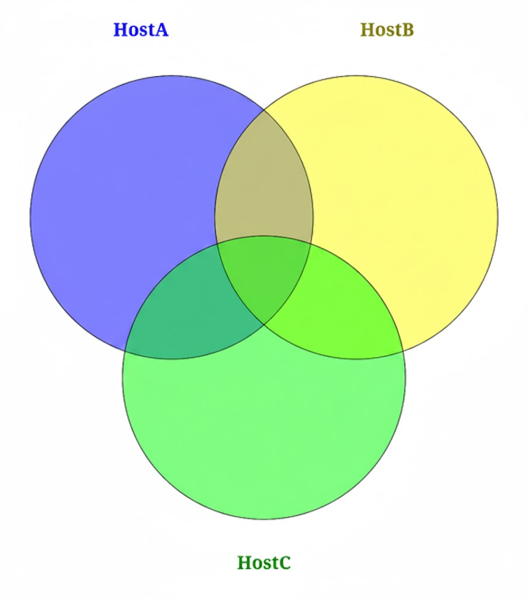

# RFLXN's NixOS Flake

This repository manages three NixOS machines with a module-host composition pattern:

- `rflxn-desktop` (x86_64, Hyprland based  DE)
- `rflxn-asahi` (aarch64, Apple Silicon/Asahi Linux + Hyprland based DE)
- `rflxn-server` (x86_64, headless/server workloads)


## Repository Layout

```text
nix/
├── flake.nix
├── modules/
│   ├── desktop/
│   ├── services/
│   ├── programs/
│   ├── hardware/
│   └── system/
└── hosts/
    ├── rflxn-desktop/
    ├── rflxn-asahi/
    └── rflxn-server/
```

## Composition Model

Modules follow a curried pattern:

```nix
{ optionA ? defaultA, ... }:
{ pkgs, lib, username, ... }:
{ ...config... }
```

Hosts compose those modules in `hosts/<name>/configuration.nix`.

### Why This Pattern

This repo targets multiple systems that share many common configuration values, but need different host-specific keys and toggles.

So the pattern is:

- Define reusable groups of key/value config in modules.
- Pull those groups from each host and pass host-specific options/overrides.

This keeps shared values consistent across machines while still allowing each host to enable different features (for example, Hyprland vs Plasma, desktop vs server services, monitor/workspace layout differences).



## Flake Overview

`flake.nix` defines:

- Stable base: `nixos-25.11`
- Additional inputs: `home-manager`, `impermanence`, `plasma-manager`, `lanzaboote`, `vscode-server`, `apple-silicon`, `astal`, `ags`, etc.
- Shared values: `username`, locale/timezone, Syncthing device IDs
- Per-host `mkSystem` entrypoints:
  - `hosts/rflxn-desktop/default.nix`
  - `hosts/rflxn-asahi/default.nix`
  - `hosts/rflxn-server/default.nix`

## Host Profiles

### `rflxn-desktop`

- Platform: `x86_64-linux`
- Session stack: Hyprland (UWSM) + greetd autologin + AGS + Hyprshell + Hyprlock + Hyprpolkit + tray bridge
- Display/layout: dual-monitor setup (`DP-3` + `HDMI-A-1`) with workspace layouts split between `master` (1-5) and `scrolling` (6)
- Theming: Rose Pine GTK/Qt, Papirus icons, Rose Pine cursor (xcursor + hyprcursor)
- Wallpaper/rules: Linux Wallpaper Engine (per-monitor wallpapers), Spotify/Vesktop pinned to workspace `6`
- Services: PipeWire (low-latency + denoised mic), rootless Docker (`btrfs`), Flatpak, Syncthing (user), Tailscale, keyd, rtkit, GPU screen recorder
- Programs: full desktop + gaming + dev set (Steam/Gamescope/Wine, JetBrains, LibreOffice, Firefox, VSCode, etc.)
- Boot/system: EFI + Lanzaboote + systemd-boot + Plymouth + Impermanence + NetworkManager (Wi-Fi) + zram

### `rflxn-asahi`

- Platform: `aarch64-linux` (Apple Silicon)
- Session stack: Hyprland (UWSM) + greetd autologin + AGS + Hyprshell + Hyprlock + Hyprpolkit + logind tuning
- Input/display: laptop-first setup with touchpad defaults + 3-finger workspace gesture on `eDP-1`
- Firmware: requires local Asahi firmware directory at `hosts/rflxn-asahi/firmware`
- Services: PipeWire, battery logger (`macsmc-battery`), rootless Docker (`btrfs`), Flatpak, Syncthing (user), Tailscale, keyd/libinput/rtkit
- Programs: desktop/dev suite with aarch64 Firefox Widevine support
- Hardware/system: EFI (`canTouchEfiVariables = false`), systemd-boot, Impermanence, NetworkManager (Wi-Fi), Bluetooth, graphics (`enable32Bit = false`), zram

### `rflxn-server`

- Platform: `x86_64-linux`
- Role: headless server + remote/dev infra
- Services: Docker (includes Cloudflare DDNS container), Syncthing (system service), SSH, Tailscale, VSCode server, JetBrains Remote, Home Manager
- Programs: shell + CLI dev essentials (zsh, git, direnv, nix-index, claude-code, common tools)
- Boot/system: EFI + systemd-boot + Impermanence + standard nix cache/GC/optimise configuration

## Build Commands

```bash
# Desktop
sudo nixos-rebuild switch --flake .#rflxn-desktop

# Asahi
sudo nixos-rebuild switch --flake .#rflxn-asahi

# Server
sudo nixos-rebuild switch --flake .#rflxn-server
```

## Prerequisites & Secrets

### Global

1. Btrfs layout is expected (`@root`, `@nix`, `@persist` subvolumes).
2. User password hash file:

```bash
mkdir -p /persist/secrets
mkpasswd -m sha-512 > /persist/secrets/rflxn.hashedPassword
```

### Desktop (`rflxn-desktop`)

- If using Lanzaboote/Secure Boot, create and enroll keys for `sbctl` (stored at `/var/lib/sbctl`, persisted by module config).

### Asahi (`rflxn-asahi`)

- Provide firmware files in `hosts/rflxn-asahi/firmware` (gitignored).
- Build throws if firmware is missing.

### Server (`rflxn-server`)

- DDNS container expects:

```bash
mkdir -p /persist/secrets
echo "API_KEY=your_cloudflare_api_token" > /persist/secrets/ddns.env
```

## Module API Map

Exported helper signatures below are based on the current `modules/` source.

### `modules.desktop`

- `useGreetd { enableRegreet ? false, regreetCompositor ? "hyprland", regreetPrimaryMonitor ? null, enableAutoLogin ? false, autoLoginSession ? "uwsm-hyprland" }`
- `useSddm { enableHidpi ? false, waylandCompositor ? "weston" }`
- `useXdgPortal { enableKdeSupport ? false, enableHyprlandSupport ? false, enableGtkSupport ? enableHyprlandSupport }`

#### `modules.desktop.gtk.theme`

- `usePapirusIcon { theme ? "Papirus-Dark" }`
- `useRosePine { variant ? "main", windowOpacity ? 0.85 }`

#### `modules.desktop.hyprland`

- `appearance { gapSize ? 5, borderSize ? 2, rounding ? 10, activeBorderColor ? "rgb(89b4fa)", inactiveBorderColor ? "rgb(585b70)", enableAnimations ? true, enableBlur ? true, activeOpacity ? 0.94, inactiveOpacity ? 0.86, fullscreenOpacity ? 1.0, blurSize ? 8, blurPasses ? 2 }`
- `useAgs { sourceDir ? null }`
- `useDarkMode { qtUseGtkPlatformTheme ? true }`
- `useDunst { fontSize ? 11, font ? "Noto Sans", cornerRadius ? 10, width ? 350, offset ? "15x15" }`
- `useHyprbars {}`
- `useHypridle { timeToScreenOff ? 600, timeToLock ? 900, timeToSuspend ? 1800 }`
- `useHyprland { enableXWayland ? true, monitors ? null, workspaces ? null, followMouse ? 1, pointerSpeed ? 0, enableMouseAcceleration ? false, disableHardwareCursors ? false }`
- `useHyprlock {}`
- `useHyprpolkit {}`
- `useHyprshell { modifier ? "alt" }`
- `useRofi {}`
- `useTrayBridge {}`
- `useWaybar {}`

#### `modules.desktop.hyprland.cursors`

- `useRosePineCursor { cursorSize ? 24 }`

#### `modules.desktop.hyprland.keybinds`

- `useDefaults { mod ? "SUPER", subMod ? "SUPER SHIFT" }`
- `useAgsLauncher { key ? "SUPER, D" }`
- `useAgsRestart { key ? "SUPER, backslash" }`
- `useGsrSaveReplay { key ? "ALT, F9" }`
- `useHyprshot { key ? "Print" }`
- `useKitty { key ? "SUPER, R" }`
- `usePrintscreen { key ? ", Print" }`
- `useRofi { key ? "SUPER, D" }`
- `useSpectacle { key ? ", Print" }`

#### `modules.desktop.hyprland.touchpad`

- `useDefaults {}`

#### `modules.desktop.hyprland.touchpad.gestures`

- `useWorkspaces {}`

#### `modules.desktop.hyprland.wallpaper`

- `useHyprpaper { wallpaper ? null, monitors ? [], wallpapers ? [] }`
- `useLinuxWallpaperEngine { wallpapers, fps ? 60 }`

#### `modules.desktop.hyprland.windowRules`

- `useDefaults {}`
- `useFixedSpotify { workspace }`
- `useFixedVesktop { workspace }`
- `useWorkspacePseudo { workspace }`

#### `modules.desktop.logind`

- `useLogind {}`

#### `modules.desktop.plasma6`

- `usePlasma6 { overrideConfig ? false, excludePackages ? [], enableSddmIntegration ? true, persistPath ? null }`

#### `modules.desktop.plasma6.kwin`

- `disableWindowBarrier {}`
- `useBlur { strength ? 5 }`

#### `modules.desktop.plasma6.shortcuts`

- `useGsrSaveReplay { key }`
- `useKitty { key }`
- `useRestartWallpaper { key }`

#### `modules.desktop.plasma6.theme`

- `useLeaf {}`

#### `modules.desktop.qt.theme`

- `usePapirusIcon { theme ? "Papirus-Dark" }`
- `useRosePine { variant ? "main", accent ? "rose", useOverlay ? true, kvantumTranslucentWindows ? true, kvantumBlurring ? true, kvantumPopupBlurring ? true, kvantumReduceWindowOpacity ? 12 }`

### `modules.services`

- `pipewire.usePipewire {}`
- `pipewire.useDenoisedMic {}`
- `pipewire.useLowLatency {}`
- `useBatteryLogger { logFile ? null, lockFile ? null, powerSupplyDir ? null, batteryDeviceName ? null }`
- `useDocker { isBtrfs ? false, isRootless ? false, containersAsService ? {}, persistPath ? null }`
- `useFlatpak { persistPath ? null }`
- `useGpuScreenRecorder { window ? "screen", framerate ? 60, replaySeconds ? 300, quality ? "high", container ? "mp4", audioSource ? "default_output", outputDir ? null }`
- `useHomeManager { stateVersion ? "25.11", backupCommand ? null }`
- `useJetbrainsRemote { ides ? [] }`
- `useKeyd { settings ? {} }`
- `useLibinput {}`
- `useLinuxWallpaperengine { wallpapers, fps ? 60, bindToPlasma ? false }`
- `useRtkit {}`
- `useSsh { persistPath ? null, allowPasswordLogin ? false }`
- `useSyncthing { devices ? {}, folders ? {}, serviceLevel ? "user", persistPath ? null }`
- `useTailscale { persistPath ? null }`
- `useVscodeServer {}`

### `modules.programs`

#### Aggregated namespaces

- `shell.useShell {}`
- `shell.useZsh {}`
- `jetbrains.useIntellij { enableZshAlias ? false }`
- `jetbrains.usePycharm { enableZshAlias ? false }`
- `jetbrains.useWebstorm { enableZshAlias ? false }`
- `gaming.useLsfgVk {}`
- `gaming.useProtonplus {}`
- `gaming.useR2modman {}`
- `gaming.useSteam { enableGamescope ? false, enableProtontricks ? false }`
- `gaming.useWine { isWayland ? false }`

#### Direct helpers

- `useAyugram {}`
- `useBlueman {}`
- `useClaudeCode {}`
- `useCodex {}`
- `useCommonTools {}`
- `useDirenv {}`
- `useDiscord {}`
- `useDolphin {}`
- `useFastfetch { beforeModules ? [], afterModules ? [] }`
- `useFirefox { enableWidevine ? false }`
- `useGit { name, email }`
- `useHaruna {}`
- `useHyprshot {}`
- `useKcalc { enableWindowsAlias ? false }`
- `useKitty {}`
- `useKolourpaint { enableWindowsAlias ? false }`
- `useLact { enableDaemon ? true }`
- `useLibreOffice {}`
- `useNixIndex {}`
- `useNmApplet {}`
- `usePwvucontrol {}`
- `useSpectacle {}`
- `useSpotify {}`
- `useThunar {}`
- `useVscode {}`
- `useWaylandUtils {}`

### `modules.hardware`

- `useAmdGpu { enable32Bit ? true, enableOverdrive ? false }`
- `useBluetooth { persistPath ? null }`
- `useGraphics { enable32Bit ? true }`
- `useOpenrazer {}`

### `modules.system`

#### `modules.system.boot`

- `useEfiBoot { canTouchEfiVariables ? false }`
- `useLanzaboote { persistPath ? null }`
- `usePlymouth { theme ? "breeze", enableQuietBoot ? true }`
- `useSystemdBoot { consoleMode ? null, configurationLimit ? 15 }`

#### `modules.system.nix`

- `useCache {}`
- `useExperimentalFeatures {}`
- `useGc { dates }`
- `useOptimise { dates }`
- `useUnfreePackage {}`

#### `modules.system` helpers

- `useCjkFonts {}`
- `useFcitx5 {}`
- `useImpermanence { rootUuid, persistPath ? null, directories ? [], files ? [] }`
- `useMe { hashedPassword ? null, hashedPasswordFile ? null, extraGroups ? [] }`
- `useNetworkManager { useWifi ? false, persistPath ? null }`
- `useZram { memoryPercent ? 25, priority ? 10 }`

## AGS Workflow (Current)

Recommended development loop:

- Keep AGS source in `my-ags/`
- Symlink for fast iteration:

```bash
ln -sfn /home/rflxn/nix/my-ags ~/.config/ags
```

Declarative snapshot also exists at `modules/desktop/hyprland/ags/.config/`, but active development is expected to happen in `my-ags/` and then be synced intentionally.
